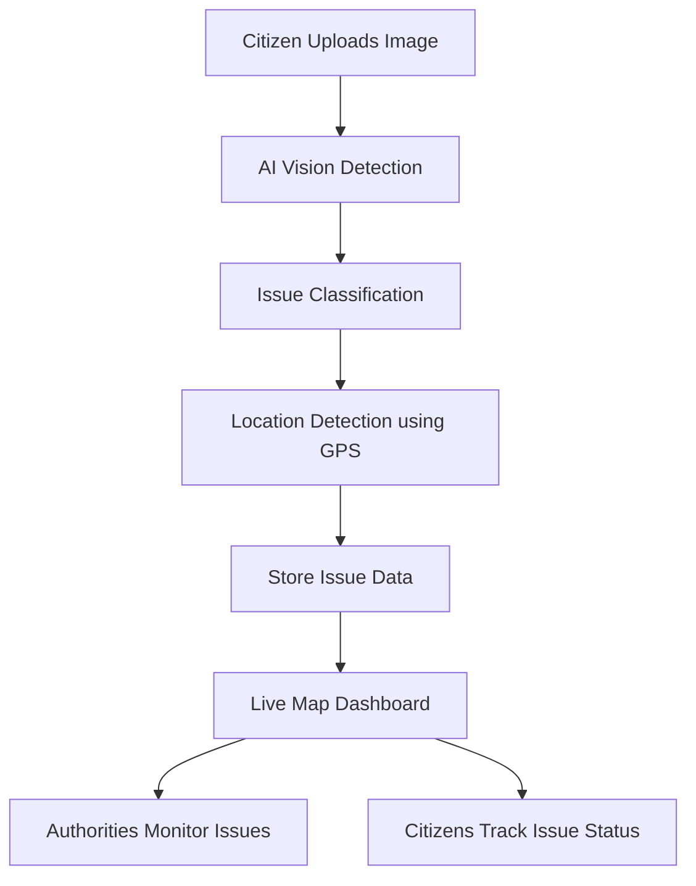

# 👁️ CivicEye  
### AI-Powered Civic Issue Detection & Smart Public Safety Platform

<div align="center">

**Empowering citizens to report, detect, and resolve urban infrastructure problems using AI and real-time monitoring.**


</div>

---

# 🌍 The Problem

Urban infrastructure issues such as:

- 🕳️ Potholes  
- 💡 Broken streetlights  
- 🗑️ Garbage accumulation  
- 🚧 Road hazards  

often go **unnoticed or unreported for long periods**.

Traditional reporting systems are:

❌ Slow  
❌ Manual  
❌ Lack transparency  
❌ Poor citizen engagement  

This delay can lead to **accidents, poor city maintenance, and frustration among citizens.**

---

# 💡 Our Solution — CivicEye

**CivicEye** is a **smart civic monitoring platform** that uses **AI-powered image detection and location tracking** to automatically detect and report infrastructure problems.

Citizens simply **upload an image**, and CivicEye will:

1️⃣ Detect the issue using **AI Vision**  
2️⃣ Identify the **problem category**  
3️⃣ Pin the issue on a **live city map**  
4️⃣ Notify authorities for action  

This creates a **transparent bridge between citizens and governance.**

---

# 📸 Project Screenshots

## 🏠 User Reporting Interface


Users upload images of civic issues like potholes, garbage dumps, or damaged infrastructure.

---

## 🗺️ Civic Issue Map Dashboard


Interactive dashboard showing reported issues across the city with location markers.

---

## 📊 Admin Monitoring Panel


Authorities can monitor reports, analyze issue clusters, and prioritize repairs.

---

# ⚡ Key Features

## 🤖 AI Issue Detection
Detects civic issues using **Computer Vision APIs**

Supported detections:

- Potholes
- Garbage dumps
- Broken streetlights
- Road damages
- Water leakage

---

## 📍 Smart Location Detection

Automatically detects user location using:

- GPS
- Browser Geolocation API

---

## 🗺️ Live Issue Heatmap

All reported issues appear on a **live interactive map** showing:

- Issue type
- Location
- Status
- Timestamp

---

## 📢 Smart Alerts

If multiple reports occur in the same area, the system automatically flags it as **high priority**.

---

## 👥 Public Transparency Portal

Citizens can:

✔ View nearby civic issues  
✔ Track issue status  
✔ Monitor city infrastructure  

---

# 🏗 System Architecture



---

# 🧠 How It Works

1️⃣ Citizen uploads image of civic problem  
2️⃣ AI analyzes image and detects issue type  
3️⃣ Browser captures GPS location  
4️⃣ Issue is plotted on live city map  
5️⃣ Authorities monitor and resolve issues  

---

# 🛠 Tech Stack

## Frontend
- HTML5  
- CSS3  
- JavaScript  

## AI / Detection
- OpenAI Vision API  
- Computer Vision APIs  

## Maps
- Leaflet.js / Google Maps API  

## Location
- Browser Geolocation API  

## Deployment
- GitHub Pages  
- Vercel  
- Netlify  

---

# 🚀 Getting Started

## 1️⃣ Clone Repository

```bash
git clone https://github.com/yourusername/CivicEye.git
```

---

## 2️⃣ Open Project

```bash
cd CivicEye
```

---

## 3️⃣ Run Website

Open:

```
index.html
```

in your browser.

---

# 📌 Future Scope

### Planned Features

- 🔔 Real-time government notifications  
- 📊 Analytics dashboard for city authorities  
- 📱 Mobile application  
- 🤖 Advanced AI model for better detection  
- 🛰️ Smart CCTV integration  
- 🧠 Predictive infrastructure maintenance  

---

# 🌟 Impact

CivicEye enables:

🏙️ **Smarter Cities**  
👥 **Citizen Participation**  
⚡ **Faster Issue Resolution**  
📊 **Transparent Governance**

---

# 🤝 Contributing

We welcome contributions.

1. Fork the repository  
2. Create a new branch  
3. Submit a pull request  

---

# 📜 License

This project is licensed under the **MIT License**.

---

# ❤️ Built for Smart Cities

**CivicEye – Because every citizen deserves a safer city.**
